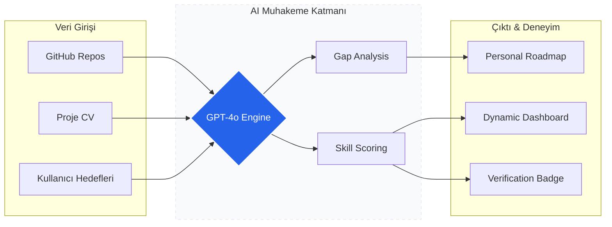

<div align="center">

<!-- Hero Section -->
<table width="100%">
  <tr>
    <td align="center" style="background: linear-gradient(135deg, #0f172a 0%, #1e293b 100%); padding: 40px; border-radius: 20px;">
      
      <h1 style="color: #60a5fa; font-size: 3rem; margin: 10px 0;">Skill Identity Engine</h1>
      <p style="color: #94a3b8; font-size: 1.2rem; max-width: 600px;">
        Veri Madenciliği ve Yapay Zeka ile Güçlendirilmiş<br/><b>Yeni Nesil Teknik Kimlik ve Kariyer Operasyon Merkezi</b>
      </p>
      <br/>
      <div style="display: flex; justify-content: center; gap: 10px; flex-wrap: wrap;">
        
        
        
      </div>
    </td>
  </tr>
</table>

<br/>

---

## 💎 Proje Vizyonu
Geleneksel CV'lerin ötesinde, **Skill Identity Engine** yazılımcılar için yaşayan, doğrulanabilir bir teknik ekosistem sunar. Platform, statik beyanları dinamik kanıtlara dönüştürerek "Kariyer Mühendisliği" disiplinini kurumsal bir seviyeye taşır.

## 🛠️ Teknoloji Ekosistemi

<table width="100%">
  <thead>
    <tr style="background-color: #1e293b;">
      <th width="33%" align="left">🔹 Katman</th>
      <th width="67%" align="left">🚀 Teknolojiler</th>
    </tr>
  </thead>
  <tbody>
    <tr>
      <td><b>Core Interface</b></td>
      <td>
        
        
        
      </td>
    </tr>
    <tr>
      <td><b>Visual Engine</b></td>
      <td>
        
        
        
      </td>
    </tr>
    <tr>
      <td><b>Data & Intelligence</b></td>
      <td>
        
        
        
      </td>
    </tr>
  </tbody>
</table>

<br/>

## 🎯 Temel Direkler (Core Pillars)

| Özellik | Açıklama | Teknoloji / Yaklaşım |
| :--- | :--- | :--- |
| **Deep-Mining** | GitHub ve CV verilerini atomik seviyede ayrıştırarak yetenek haritası çıkarır. | LLM Based Extraction |
| **Delta Analysis** | Hedef rol ile mevcut profil arasındaki teknik açığı hesaplar. | Vector Embeddings |
| **Growth Ops** | Kişiye özel dinamik roadmap'ler ve AI destekli mülakat hazırlığı sunar. | Agentic AI Coaching |
| **Proof-of-Skill** | Teknik meydan okumalar ve testlerle becerileri doğrulanabilir skorlara dönüştürür. | Validation Protocols |

<br/>

## 🏗️ Sistem Mimarisi



<br/>

## 🚀 Hızlı Başlangıç (Quick Start)

<details>
<summary><b>�️ Kurulum Adımlarını Göster</b></summary>
<br/>

### Gereksinimler
- **Node.js:** v18.0.0+
- **Bun/npm/yarn**

### Kurulum

```bash
# 1. Projeyi Yerelleştirin
git clone https://github.com/project-repo/skill-identity-engine.git
cd skill-identity-engine

# 2. Bağımlılıkları Kurun (Bun önerilir)
bun install

# 3. Çevre Değişkenleri (.env)
VITE_SUPABASE_URL=your_endpoint
VITE_SUPABASE_ANON_KEY=your_key

# 4. Motoru Çalıştırın
npm run dev
```
</details>

---

<div align="center">
  
  <br/>
  <sub>Skill Identity Engine - Professional Identity Platform. 2026</sub>
</div>

</div>
